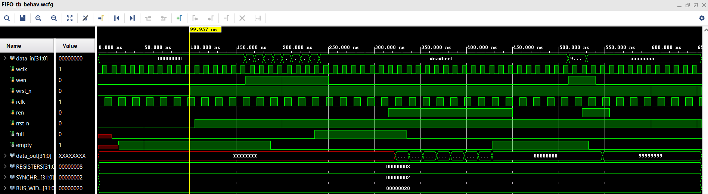

# AsyncFIFO

## Overview
This project implements an **Asynchronous FIFO (First-In First-Out)** in Verilog.  
The FIFO is designed to safely transfer data between two different clock domains using proper synchronization techniques.

Asynchronous FIFOs are widely used in:
- Clock domain crossing (CDC)
- High-speed communication systems
- SoC interconnects
- FPGA-based data buffering systems

---

## Design Features

- Dual clock domains (Independent Read & Write clocks)
- Gray code pointer synchronization
- Two-stage synchronizers to prevent metastability
- Full and Empty flag generation
- Parameterizable data width and depth
- Synthesizable RTL design
- Simulated and verified in Vivado

---

## Architecture

The FIFO consists of:

- Write Pointer Logic  
- Read Pointer Logic  
- Pointer Synchronization (CDC handling)  
- Memory Block  
- Full/Empty Detection Logic  

Gray code is used for pointer transfer across clock domains to ensure only one bit changes at a time, reducing metastability risks.

---

## ⏱ Waveform Results

The simulation waveform verifies:

- Correct write operation under write clock
- Correct read operation under read clock
- Proper Full and Empty flag behavior
- Safe pointer synchronization across clock domains

### Example Simulation Output:

---

## 🛠 Tools Used

- Xilinx Vivado
- Verilog HDL
- Behavioral Simulation

---

## 🎯 Learning Outcomes

- Clock Domain Crossing (CDC) handling
- Gray Code pointer implementation
- Metastability mitigation
- FIFO flag logic design
- RTL simulation and debugging

---

## Future Improvements

- Add Almost Full / Almost Empty flags
- Add formal verification
- Implement in hardware on FPGA board
